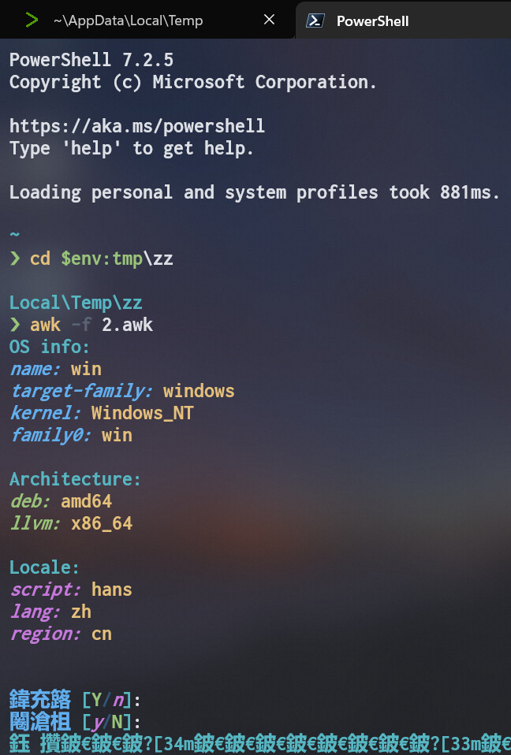

# TMOE

TMOE, More Optional Environments.


## Foreword

Sorry, guys.  
The current edition has a lot of bugs.  
In the next, if I have time, I will improve it step by step.  
For now it is only suitable for running in container environment.

Modifying tens of thousands of lines of POSIX-compliant sh & bash scripts is killing me, especially since a lot of this stuff was written years ago.

I may rewrite some of the modules in a more powerful language and gradually integrate them in. Finally, a complete rewrite!

## ChangeLog

### 2022-10-29

#### Fixed

Temporary fix for tui-related issues on debian-sid.  
Note: this is only a temporary fix.  
Waiting for upstream updates is the way to go.

Half a month ago, debian-sid updated `libpopt0` to `1.19`, which caused a problem with TUI-related parts.  
This was not the fault of `libpopt0`, they fixed a memory leak.  
However, the use of the new version of `libpopt0` for the TUI-related libraries leads to invalid pointers.

Perhaps we should not discuss pointers and memory safety in changlog.

But this is an important issue for debian, and it affects the configuration package functionality of `dpkg`.

Although we are free to choose the front end of `debconf`, it is by default the TUI front end.

#### Features

Unfortunately, no new features have been added this time.

But there is good news, the ubuntu 23.04 version codename is out!  
That's Lunar Lobster (🌙🦞).  
As per usual, I would have added it and happily written it in the commit log.
However, given the stability issues, I'll probably wait a while before adding it in.

Fortunately, you can manually change the src to 23.04.  
You can use the latest 22.10 container, then run the following cmds as root.

```sh
sed -i 's@ kinetic@ lunar@g' /etc/apt/sources.list
apt update
apt dist-upgrade
```


It's time to experience the mysterious magic of the moon!

## Preview

  
  


## Documentation

[doc.tmoe.me](https://doc.tmoe.me)
Unfortunately, the documentation is far from complete.  
And, as I am designing and rewriting the new edition, some of it may need to be revised.

## Quick Start

Just focus on steps 1 and 2.

| Step          | Description           | command                                        |
| ------------- | --------------------- | ---------------------------------------------- |
| 0(optional)   | access to tmp dir     | `cd /tmp` \|\| `cd $TMPDIR`                    |
| 1             | get awk file          | `curl -LO https://l.tmoe.me/2.awk`             |
| 2             | run it                | `awk -f 2.awk`                                 |
| 2.5(optional) | pass in specific vars | `awk -f 2.awk -v lang=zh-mo -v tmp_dir="/tmp"` |

If you can't remember, then you can use this.

```sh
rm 2.awk; wget l.tmoe.me/2.awk; awk -f 2.awk
```

Although it will automatically redirect `http` to `https`.  
However, in theory you need to worry about http **hijacking** if you don't add `https`.  
So, it's better to add it!

---

Q: I have a garbled code problem, what should I do?



If the "garbled content" is not a human-readable word or sentence, this may be a character encoding or font issue.  
If you see something in a foreign language that you don't understand, it may be a problem with an older version of i18n.  
I'm sorry that I didn't handle i18n well.  
But, the new **edition** released later may do better.

Obviously, the above is a character encoding issue.

You can specify `lang` as English: `awk -f 2.awk -v lang=en-us`  
You can also switch the encoding of the current environment to UTF-8: `cmd /K chcp 65001`

Incidentally, it is not planned to support windows for some time to come.  
Please **do not** run it on windows now!  
Although you can use it on WSL, win already has WSLg.  
So, you know, you probably don't need it.

---

Q: Is there only one method or uri for installation?

A: No. As it is hosted on the git platform, you can also get it from github or gitee.

github:

```sh
curl -LO --compressed https://raw.githubusercontent.com/2moe/tmoe/2/2.awk
awk -f 2.awk
```

Great, but slightly long.

gitee:

```sh
curl -LO https://gitee.com/mo2/linux/raw/2/2.awk
awk -f 2.awk
```

In practice, the choice of uri depends on the state of your network.  
If you have good internet. Just pick the one you like.
